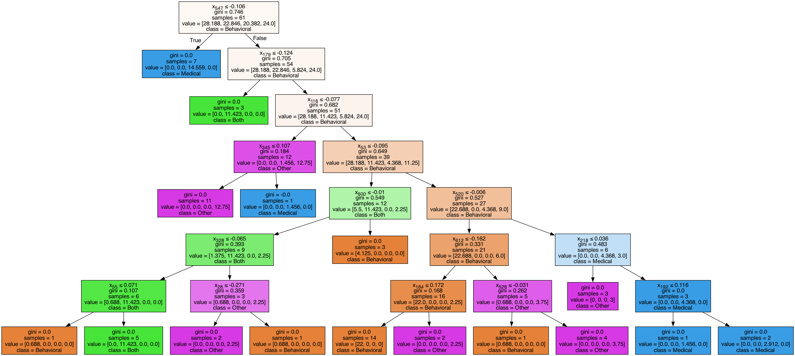
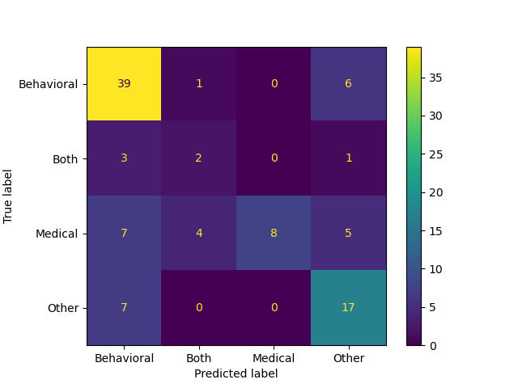

# DistilBERT Random Forest Classification
A script by Aussie Frost. Updated on Sept 18, 2024.

## Objective
Create a multi-class classification model to classify Modes of Intervention (MoI) for CAHOOTS case narratives.

## Summary
The file `classification.py` is a implementation of classifying case narratives that were transformed using DistilBERT embeddings and Random Forest Classification. 

## Data
The dataset is a set of 200 CAHOOTS Case Narratives that have been hand-labeled with MoI classifications (behavioral, medical, both, other). Information on the occurences of these labels can be found in the output file (see Results).

## Preprocessing
The text was transformed using DistilBERT embeddings. The data is split into a 50/50 train and test set. The classifications were made by merging all columns exclusive of the label column. Finally, the data is split into a 50/50 train and test set.

## Classification
Classification is performed using a Random Forest using the top 100 estimators.

## Results
The model performs at 66.0% accuracy, indicating successful multi-class classification of MoI. Test results are output in `data/dummy_case_narratives_results.csv`. Model scores and misses are output to the log file `output/dummy_case_narratives_performance.log`.

One of the decision trees took the following form:

We can understand the performance by looking at a confusion matrix:

