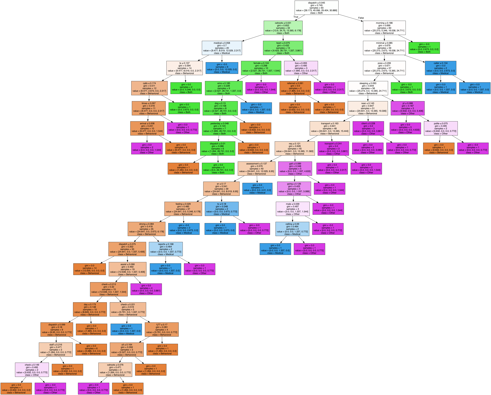
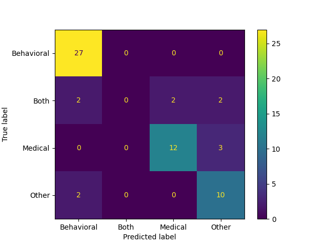

# TF-IDF Random Forest Classification
A script by Aussie Frost. Updated on Sept 30, 2024.

## Objective
Create a multi-class classification model to classify Modes of Intervention (MoI) for CAHOOTS case narratives.

## Summary
The file [case_narrative_classification.py](case_narrative_classification.py) is a implementation of classifying case narratives that were processed using TF-IDF (Term Frequency-Inverse Document Frequency) vectorization and Random Forest classification. 

## Data
The dataset is a set of 200 CAHOOTS Case Narratives that have been hand-labeled with MoI classifications (behavioral, medical, both, other). Information on the occurences of these labels can be found in the output file (see Results).

## Preprocessing
The text contained in column x is preprocessed using TF-IDF (Term Frequency-Inverse Document Frequency) Vectorization. In this case, the top 100 relevant features of each case are extracted in the form of a vectors that will be used for the Random Forest classification. Additionally, English stopwords (the, and, then, etc.) are redacted as part of preprocessing. Finally, the data is split into a 50/50 train and test set.

## Classification
Classification is performed using a Linear SVM using the top 100 estimators.

## Results
The model performs at 81.67% accuracy, indicating successful multi-class classification of MoI. Model metric results are output in '[output/dummy_case_narratives_performance.log](output/dummy_case_narratives_performance.log)'.

One of the decision trees took the following form:

We can understand the performance by looking at a confusion matrix:

